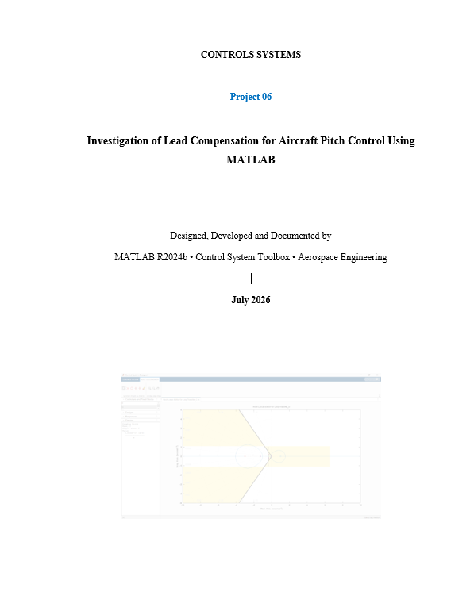

# Lead Compensator Design and Investigation for Aircraft Pitch Control Using MATLAB

**Classical Control Systems | Lead Compensator | Angle Deficiency | Control System Designer | MATLAB | Aerospace Engineering**

This repository contains my sixth independent control systems project — a systematic investigation into whether a single lead compensator can satisfy the performance specifications for the aircraft pitch control system from Projects 04 and 05.

---

## Engineering Question

> "Can a single lead compensator reshape the root locus of the aircraft pitch plant sufficiently to achieve overshoot < 10% and settling time < 10 seconds?"

**Answer: No.** This project proves it through three independent methods.

---

## Overview

Project 05 proved that pure gain selection cannot meet the specifications — the root locus never enters the desired performance region. The natural next step is lead compensation, which adds phase to pull the locus toward the desired region. Project 06 investigates whether this works on a non-minimum phase plant.

Three independent investigation methods were used:
1. **Analytical design** — angle deficiency calculation and pole-zero cancellation
2. **Systematic testing** — five lead compensator configurations with parametric analysis
3. **Optimization validation** — MATLAB Control System Designer automated tuner, both unconstrained and constrained to true lead structure

All three methods converge on the same conclusion.

---

## Plant

```
G(s) = (−1.282s + 1.282) / (s³ + 1.935s² + 0.987s + 0.179)
```

| Property | Value |
|---|---|
| RHP Zero | s = +1 (non-minimum phase) |
| Phugoid Poles | −0.3336 ± 0.1730j (dominant, lightly damped) |
| Short Period Pole | −1.2679 (fast, heavily damped) |
| Gain Margin (from P05) | K = 0.46 |

**Performance Specifications:**
- Overshoot < 10% → damping ratio ζ ≥ 0.59
- Settling time < 10 s → real part σ ≥ 0.4
- Desired dominant pole: s_d = −0.5 + 0.6j

---

## Angle Deficiency Analysis

The angle deficiency is the phase a compensator must provide to place the desired pole on the root locus.

| Source | Location | Angle at s_d (degrees) |
|---|---|---|
| Pole p₁ | −1.2679 | 38.00 |
| Pole p₂ | −0.3336 + 0.173j | 111.29 |
| Pole p₃ | −0.3336 − 0.173j | 102.15 |
| Zero z₁ | +1 | 158.20 |

```
Plant angle = 158.20° − (38.00 + 111.29 + 102.15)° = −93.24°
Required phase lead = 180° − 93.24° = 86.75°
```

**Single-stage lead compensator practical maximum: ~60–65°**

Required lead (86.75°) > Maximum achievable (65°) → Single lead compensator is theoretically insufficient.

---

## Systematic Testing — Five Lead Compensators

| Test | Zero | Pole | Gain K | Rise Time | Settling Time | Overshoot | Specs Met? |
|---|---|---|---|---|---|---|---|
| 1 | −0.5 | −2 | 0.6116 | 1.77 s | 13.31 s | 28.61% | ❌ |
| 2 | −0.8 | −4 | 1.2059 | 1.56 s | 17.46 s | 41.65% | ❌ |
| 3 | −1.0 | −5 | 1.1598 | 1.78 s | 18.73 s | 38.77% | ❌ |
| 4 | −1.5 | −6 | 0.7245 | 2.33 s | 20.82 s | 30.40% | ❌ |
| 5 | −2.0 | −8 | 1.4032 | 1.50 s | 42.23 s | 70.19% | ❌ |

**Every configuration failed both specifications.**

**Dominant pole trend (real part):**

| Test | Dominant Pole Real Part | Direction |
|---|---|---|
| 1 | −0.3045 | Baseline |
| 2 | −0.2254 | → Moving toward imaginary axis |
| 3 | −0.2107 | → Worsening |
| 4 | −0.2049 | → Still worsening |
| 5 | −0.0938 | → Very close to imaginary axis |

Stronger lead compensation moves poles toward instability — the same counterintuitive result seen with pure gain increase in Project 05.

---

## Control System Designer Investigation

Interactive exploration in MATLAB Control System Designer confirmed:

- True lead structures (|p| > |z|) consistently failed to move the root locus into the desired region
- When a lag-like structure was accidentally tested, the locus entered the desired region but the closed-loop system was **unstable** (poles at s = +0.198 ± 0.755j)
- This demonstrates: a root locus passing through the desired region does not guarantee stable performance — gain selection and pole verification are always required

---

## Optimization Validation

| Case | Constraint | Result | Converged To |
|---|---|---|---|
| Unconstrained | None | ✅ Feasible solution found | Lag compensator (|z| > |p|) |
| Constrained | True lead only | ❌ No feasible solution | N/A |

MATLAB's optimizer, when unrestricted, chose a **lag compensator** to satisfy the specifications. When constrained to true lead structure, no solution could be found.

This is the strongest evidence: a numerical optimizer searched the entire lead compensator parameter space and confirmed infeasibility.

---

## Complete Controller Comparison

| Controller | Rise Time | Settling Time | Overshoot | SS Error | Specs? |
|---|---|---|---|---|---|
| Open Loop | 7.56 s | 13.93 s | 0.23% | Very large | ❌ |
| P only (K=0.1) | 3.42 s | 13.23 s | 18.15% | 58% | ❌ |
| PID pidtune() | 1.99 s | 19.49 s | 3.39% | 0% ✅ | ❌ (ts) |
| Best Lead (Test 1) | 1.77 s | 13.31 s | 28.61% | Large | ❌ |
| Worst Lead (Test 5) | 1.50 s | 42.23 s | 70.19% | Large | ❌ |

No controller across Projects 04–06 has simultaneously met both specifications.

---

## Key Engineering Conclusions

**1.** Required phase lead of 86.75° exceeds single-stage practical limit of ~65°. This analytically predicted failure before any simulation.

**2.** All five true lead compensators failed both specifications. The best achieved 28.61% overshoot and 13.31s settling time.

**3.** Stronger lead compensation worsens performance — dominant poles move toward the imaginary axis, exactly as with pure gain increase.

**4.** MATLAB optimizer confirmed: no true lead compensator satisfies the specifications. When unconstrained, it chose a lag structure.

**5.** The RHP zero at s = +1 is the root cause. It limits achievable closed-loop bandwidth and pulls root locus branches toward the unstable region regardless of lead compensator design.

**6.** The specifications are achievable — but not with lead compensation. State-space methods (Projects 09–11) will demonstrate this.

---

## Project Roadmap

```
✅ Project 01 — Mass-Spring-Damper Analysis
✅ Project 02 — DC Motor Modeling
✅ Project 03 — PID Speed Control
✅ Project 04 — Aircraft Pitch Control
✅ Project 05 — Root Locus Design
✅ Project 06 — Lead Compensator Investigation ← YOU ARE HERE

→ Project 07 — Lead-Lag Compensator Design
→ Project 08 — Frequency Response Analysis
→ Project 09 — State-Space Modeling
→ Project 10 — Pole Placement Control
→ Project 11 — LQR Optimal Control
→ Project 12 — Kalman Filter Design
→ Project 13 — UAV Attitude Control
→ Project 14 — Rocket Attitude Control
→ Project 15 — Satellite Attitude Control
→ Project 16 — Missile Guidance and Control
→ Project 17 — Integrated Flight Control System
```

---

## Software Used

- MATLAB R2024b
- Control System Toolbox
- Control System Designer (SISO Tool)

---

## Author

**Zohaib Imtiaz**
Aerospace Engineering Student | Teknofest VLR Team — Flight Control

---

## License

This project is released under the MIT License.


## Project Cover



--- 
